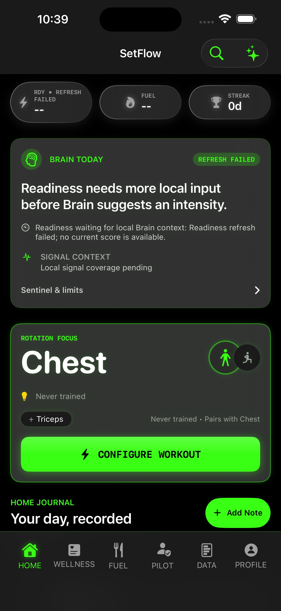
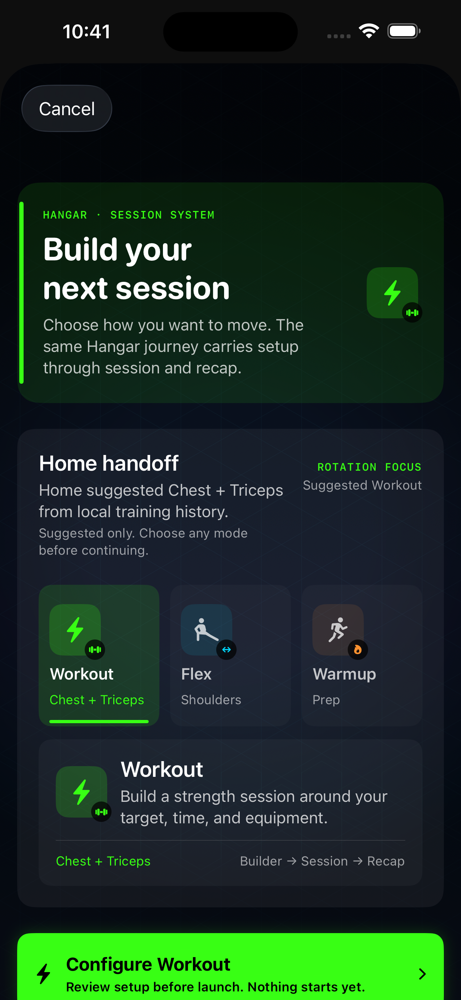
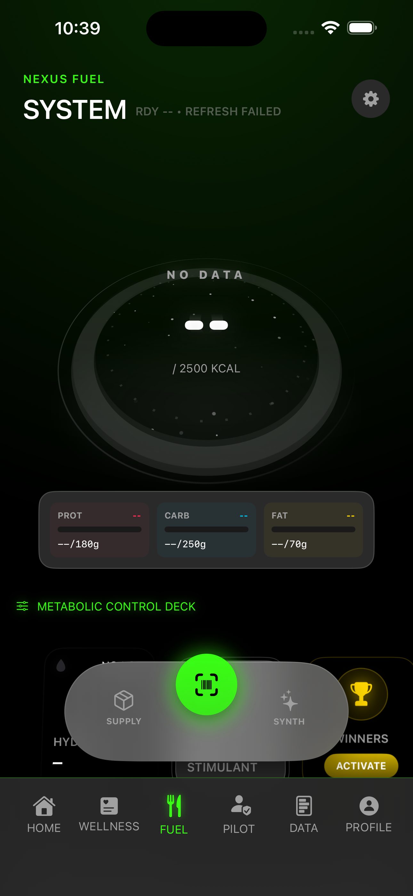
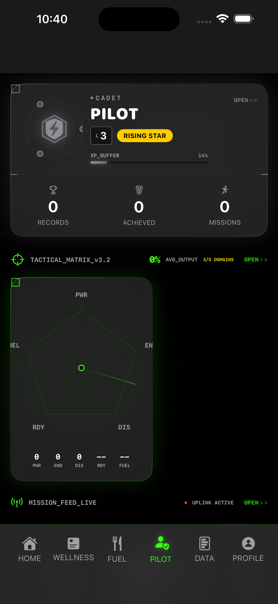
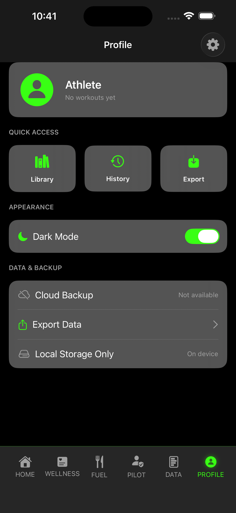
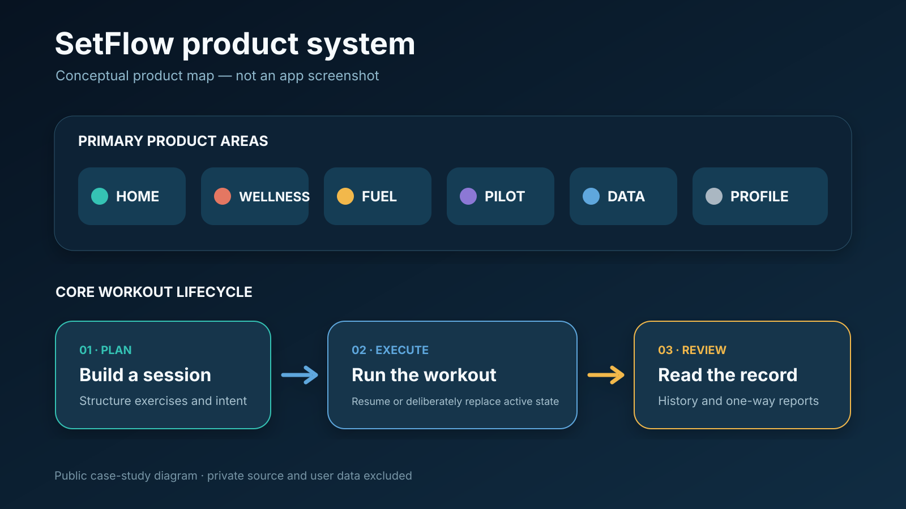
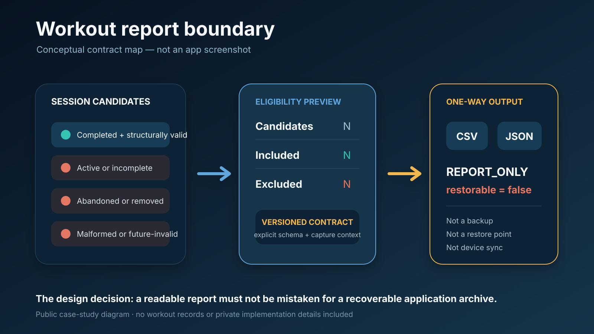

# SetFlow — Private iOS Product Case Study

SetFlow is a private iOS strength-training product in active development. It
brings workout planning, live session execution, retained history, wellness
context, fuel planning, progress, data, and profile experiences into one system.

I designed and built SetFlow as an independent product project using Swift,
SwiftUI, and SwiftData. This repository is a recruiter-facing case study—not the
application source, an App Store listing, or a claim of production readiness.

> **Public boundary:** the source code, proprietary implementation details,
> credentials, personal data, monetization work, and unreleased plans remain
> private. The five product images are privacy-reviewed iOS Simulator captures;
> the two diagrams are conceptual product maps, not app screenshots.

## The product problem

Strength-training tools often split the experience across disconnected workout,
recovery, nutrition, progress, and profile surfaces. That fragmentation makes it
harder to move from planning to execution and then understand what happened.

SetFlow explores a unified product model: build the session, complete it, review
the record, and keep adjacent context accessible without pretending that every
signal is complete or clinically meaningful.

## What I am building toward

The product direction is a trustworthy training operating system: a user should
be able to move from intent to execution to review while the product preserves
continuity and explains what it knows, what it inferred, and what remains
uncertain.

The current direction explores:

- contextual guidance that can draw from workout history, active-session state,
  wellness, fuel, and progress without collapsing unlike signals into one
  unsupported score;
- explanations and confidence or limitation cues that keep recommendations
  reviewable instead of presenting them as unquestionable answers;
- user control over durable records, plan changes, and report generation; and
- intelligence that assists training decisions without acting as medical advice
  or silently rewriting the user's history.

These are product principles and future direction—not claims of a shipped AI
feature, model, agent, or autonomous coach. Implementation details, schedules,
and unreleased architecture remain private.

For a fast evaluation, start with the
[90-second recruiter path](docs/recruiter_quick_start.md). The
[product journey](docs/product_journey.md) expands the workflow, while the
[expectations and evidence map](docs/product_expectations.md) distinguishes
what has been demonstrated from future direction and explicit non-claims.

## Intended users

- strength-training users who want a structured session workflow
- users who prefer workout, wellness, fuel, and progress context in one product
- athletes who value transparent limits around saved data and exported reports

## My role

Independent product builder across:

- product framing and feature prioritization
- SwiftUI navigation and interaction design
- workout planning and active-session workflows
- SwiftData-backed persistence work
- failure-state and portability decisions
- validation, documentation, and privacy-conscious public packaging

## Verified product surface

The current private source routes to six top-level experiences:

1. **Home** — entry point for the current training context and workout flow
2. **Wellness** — recovery-oriented context and history surfaces
3. **Fuel** — nutrition and refuel-oriented context
4. **Pilot** — progress and gamification experiences
5. **Data** — athlete activity and history views
6. **Profile** — preferences and user-controlled context

## Product walkthrough

These images were captured from a dedicated iOS Simulator UI-test run on
August 9, 2026 and reviewed before publication. They show the visible product
shell in demo/test state; they do not contain a real user's account, health, or
workout data. A simulator capture establishes the visible interface shown here,
not App Store availability, production deployment, or release readiness.

| Home | Workout Hangar | Fuel |
|---|---|---|
|  |  |  |

| Pilot | Profile |
|---|---|
|  |  |

The screenshot set demonstrates the shared navigation system and distinct
workout, nutrition, progress, and preference contexts. The
conceptual map below explains how those visible surfaces relate without exposing
private implementation structure.

Home connects to a structured session builder and an active-workout runtime.
Completed workout records can be prepared as CSV or JSON reports through an
explicitly one-way export contract.



## Selected product and engineering decisions

### Keep planning and execution connected

The workout entry flow checks for an existing active session before starting a
new one. Users can resume the existing session or deliberately abandon it before
creating another. This makes session continuity an explicit product decision
instead of an accidental state transition.

### Separate adjacent contexts without hiding them

Workout, wellness, fuel, progress, history, and profile surfaces remain distinct
top-level areas. The goal is a coherent product shell without collapsing unlike
data or implying that every signal has the same quality.

### Make portability language precise

SetFlow can generate versioned CSV and JSON workout reports after evaluating
which sessions are eligible. The artifact is intentionally marked
`REPORT_ONLY` and `restorable=false`.

That means the export is useful for review and portability, but it is **not** a
backup, restore point, device-sync mechanism, or complete database archive.



### Design failure states around user trust

The private app source contains explicit persistent-store recovery states and an
in-memory fallback warning. The public lesson is broader than the implementation:
when persistence is degraded, the product should state that clearly and avoid
silently presenting temporary state as durable data.

## Technology demonstrated

- Swift and SwiftUI
- SwiftData persistence
- stateful workout planning and execution flows
- versioned CSV/JSON report generation
- input eligibility and exclusion handling
- accessible labels and explicit user-facing state boundaries
- Git-based iterative product development

## Applied-AI engineering relevance

I use AI-assisted development as a governed engineering workflow across problem
decomposition, implementation options, debugging, documentation, and audit
support. Suggestions remain subject to human review, source inspection, builds,
tests, runtime checks, and the evidence boundaries documented in this package.

That workflow demonstrates how I collaborate with modern coding agents without
treating generated output as proof. It is distinct from in-product AI: this case
study does **not** claim that an LLM, retrieval system, fine-tuned model, or
autonomous coaching agent is currently shipped inside SetFlow.

## Product expectations at a glance

SetFlow is presented as an in-development private product, so the public story
uses four evidence states instead of treating every idea as shipped:

- **Runtime demonstrated** — visible behavior represented by one of the five
  reviewed simulator captures.
- **Source/reachability evidenced** — behavior or routing checked in the private
  product snapshot but not necessarily shown in the public captures.
- **Future direction** — a problem area or product theme, never a current feature
  promise.
- **Not claimed** — production, release, health-outcome, synchronization, and
  other statements this package explicitly does not establish.

The full distinction is maintained in the
[public feature matrix](docs/public_feature_matrix.md) and
[product expectations](docs/product_expectations.md).

## What this case study proves

- I can connect product decisions to working private-source evidence.
- I can reason about navigation, state transitions, persistence, and export
  contracts across a multi-surface iOS product.
- I can communicate limitations without inflating an in-development product into
  a production or release-readiness claim.
- I can publish useful proof while keeping source and user-sensitive material
  private.
- I can use AI-assisted engineering while preserving human accountability,
  verification, and honest current-versus-future product boundaries.

## Current limitations

- SetFlow is a private in-development product, not an App Store release.
- The case study does not establish production deployment or release readiness.
- Cross-device synchronization is not claimed.
- The workout report cannot be restored into the app and is not a backup.
- Wellness and fuel surfaces should not be interpreted as medical advice.
- No deployed LLM, RAG system, fine-tuned model, or autonomous coaching agent is
  claimed in the current product evidence.
- Public screenshots are limited to the five privacy-reviewed simulator captures
  above and should not be interpreted as device, privacy, or release signoff.
- Wellness and Data routes are source-verified but are not represented by public
  runtime screenshots in this revision.
- The public package intentionally omits source code and proprietary architecture.

## Repository map

```text
README.md                         Product story and verified scope
PRODUCT_DECISIONS.md              Decision-oriented case-study detail
EVIDENCE_AND_LIMITATIONS.md       Evidence classes and claim boundaries
CASE_STUDY_USAGE.md               Viewing and reuse terms
FAQ.md                            Common questions and explicit non-claims
docs/public_feature_matrix.md     Claim-by-claim public matrix
docs/product_expectations.md      Current proof, future direction, non-claims
docs/product_journey.md           User journey and trust boundaries
docs/recruiter_quick_start.md     90-second evaluation path
media/                            Conceptual, non-screenshot diagrams
screenshots/                      Privacy-reviewed simulator product walkthrough
tests/                            Safety and package-contract checks
```

## Verify the exact package

Run the safety suite without generating bytecode inside the candidate:

```bash
PYTHONDONTWRITEBYTECODE=1 python3 -m unittest discover -s tests -v
```

The suite checks the exact 19-file contract, required recruiter content,
relative links, conceptual SVG labels, screenshot names and PNG headers,
private-path and secret patterns, and the absence of application source or
binary files.

## Contact

This case study is intended to support conversations about iOS engineering,
product thinking, data trust, and privacy-conscious software development.
